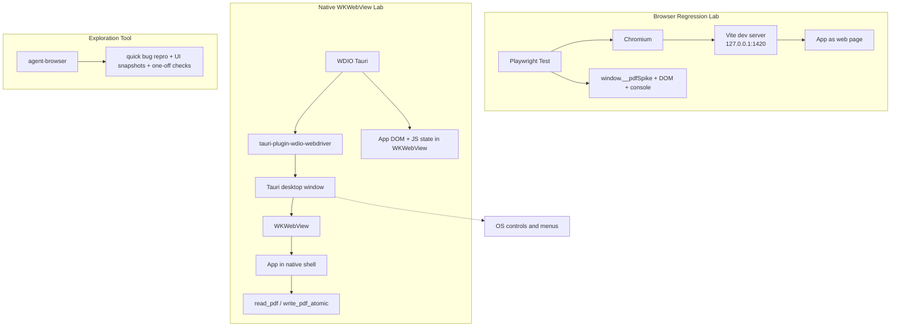

# ADR 0007: Add Native WKWebView Smoke Tests with WDIO Tauri

Status: Proposed

Date: 2026-06-26

## Context

This app is a web app wrapped by Tauri.

It behaves in two production-relevant environments:

- browser mode: `http://127.0.0.1:1420/` (Chromium automation)
- native mode: packaged Tauri desktop app on macOS (`WKWebView`)

The current browser regression harness is a large Bash script with embedded JS that is hard to maintain and reuse.
That makes coverage, retries, and onboarding more expensive than necessary.

## Beginner Mental Model

Think of this as two permanent test layers:

- Layer A: Browser regression for most behavior.
- Layer B: Native-shell smoke tests for WKWebView/runtime differences.

The browser layer should be one stable tool, not two overlapping systems.

## Terms (Beginner Friendly)

- **DOM**: The page’s visible structure (`div`, `button`, `canvas`, etc.).
- **WebView**: A browser engine embedded in a desktop app.
- **WKWebView**: macOS WebKit engine used by Tauri desktop apps.
- **Chromium**: Browser engine used by Chrome.
- **Playwright Test**: Structured browser test runner and automation framework.
- **agent-browser**: Explorer tool for ad-hoc inspection and reproduction.
- **WDIO Tauri**: WebdriverIO service for driving the real Tauri app/WebView.
- **Accessibility tree**: OS-level UI description exposed to native tooling.

## Problem

Current coverage issue is not just "more tests," it is "too much framework overlap."

Browser checks currently prove:

- rendering and interaction in Chromium,
- annotation and sidebar behavior,
- general regression paths for happy flows.

But they do not prove:

- WKWebView behavior,
- Tauri runtime/plugin behavior,
- packaged asset and filesystem behavior in the shipped app shell.

We need a native layer for those gaps. But keeping both `agent-browser` and a formal browser framework increases maintenance with no clear ownership separation.

## Decision

Use **two permanent layers by default**:

- **Playwright Test** as the canonical browser-mode regression suite.
- **WDIO Tauri** as the native `WKWebView` smoke suite.

Use `agent-browser` only as **exploratory/debug** tooling and keep it out of required regression ownership.

Adopt this lifecycle:

```text
Manual bug -> reproduce quickly in app
  -> implement in Playwright (if browser-mode)
  -> if not reproducible in browser-mode, implement in WDIO Tauri
  -> use agent-browser for quick exploration and state capture
```

## What Each Automation Layer Can See



Browser layer is best for:

- stable regression of common user flows,
- faster iteration and clearer failure reports,
- modular flow ownership.

WDIO native layer is best for:

- WebView/runtime differences,
- real `invoke()` and plugin behavior,
- native asset and file-system command paths.

Exploration tool (`agent-browser`) is best for:

- quick ad-hoc reproduction,
- interactive diagnosis,
- one-off checks that do not need to be permanent tests.

## LLM-Generated Speculative Coverage

LLM-generated cases are useful for broadening scenario ideas, but they should not automatically become regression tests.

Adopt a two-stage process:

- `Scenario generation`: LLM proposes many flows (text PDFs, scanned PDFs, annotations, persistence, outline, zoom, tool switching).
- `Curation`: engineers/prompts owner selects only high-value, reproducible, and non-duplicative scenarios.
- `Canonicalization`: curated cases become Playwright or WDIO specs.

No separate ADR is needed for this today. This behavior belongs in ADR 0007 because it is directly about how we own and execute browser/native test strategy.

## Implementation Plan (Small First)

1. Add Playwright dependencies in `pdf-annotation-spike/` and add scripts:
   - `test:e2e`
   - optional: `test:e2e:headed`
2. Port the current regression flows from `scripts/regression-agent-browser.sh` into modular Playwright specs/helpers.
3. Add fixture-level helpers (`loadPdf`, `assertRender`, `createHighlight`, `createFreeText`, `createInk`, `saveAndReopen`).
4. Keep `scripts/regression-agent-browser.sh` as a documented exploratory aid.
5. Add `@wdio/tauri-service` in `pdf-annotation-spike/` when native smoke suite starts.
6. Add `tauri-plugin-wdio-webdriver` in `pdf-annotation-spike/src-tauri/Cargo.toml` and enable for debug/test only.
7. Add required permission: `wdio-webdriver:default`.
8. Add minimal WDIO config and one native smoke test that checks:
   - app launch,
   - sample PDF render,
   - sidebar text extraction,
   - a simple annotation-state assertion.
9. Re-run browser regression + native smoke in release checks.

## Why Not Add a Third Permanent Browser Engine Layer

The cost of an additional permanent browser framework is high:

- duplicate selectors and intent,
- duplicate fixture setup,
- duplicate maintenance loops,
- harder debugging boundaries.

This ADR prefers one canonical browser framework first, then adds native only where needed.

## Maturity Note

`@wdio/tauri-service` is usable but still relatively young.

Playwright is the industrial base for browser regression because it is the least-friction canonical layer for this app today.

## Consequences

Good:

- clear ownership: one canonical browser regression suite,
- easier maintenance than dual-harness model,
- native-only bugs still caught by WDIO smoke layer,
- clearer migration path from exploratory checks to canonical tests.

Bad:

- Playwright migration effort for existing Bash/JS flow logic,
- `agent-browser` usage remains separate from CI ownership,
- WDIO still adds one native dependency and startup overhead.

## Verification

When implemented, success means:

- `npm run check` passes in `pdf-annotation-spike/`,
- `npm run build` passes in `pdf-annotation-spike/`,
- Playwright browser e2e suite passes,
- native WDIO Tauri smoke checks confirm PDF load + sidebar text/annotation state in WKWebView.
