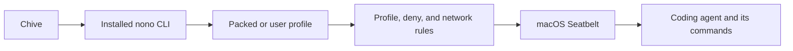

# ADR 0019: Use the Installed nono CLI for Agent Confinement

Status: Accepted

Date: 2026-07-26

## Context

Chive will give a coding agent a workspace containing files derived from a
PDF. The agent can inspect those files, run programs, and use the network. The
agent therefore needs an OS sandbox around its commands. Chive must also know
whether cancellation actually stops each command the agent starts.

Nono exposes two different integration levels:

- Its core Rust crates accept already-resolved capabilities and apply Seatbelt
  on macOS.
- Its CLI also resolves packed and user profiles, applies inherited allow and
  deny groups, configures the network proxy, finds credentials, reports useful
  errors, and supervises the launched process.

The core crates can apply a sandbox, but embedding them would make Chive
rebuild the useful CLI behavior. Chive also cannot predict every valid Codex,
Claude Code, or OpenCode installation. Runtime paths may come from Homebrew,
Bun, mise, or other user-specific setups. Nono's packed profiles are useful
defaults, and its user profiles provide the supported place for users to add
machine-specific paths.

The SP1 confinement spike tested the complete CLI path with Codex, Claude Code,
and OpenCode. It covered profile resolution, model turns, working-directory
handling, network choices, saved-login access, one outer OS sandbox, standard
input and output, exit codes, cancellation, and forced stop. The original
cleanup check passed for processes that stayed in the adapter's process group.
A later hostile check proved that a process can call `setsid()`, leave that
group, and survive group-targeted cancellation.

## Decision

Chive will launch a compatible user-installed nono CLI. It will use that
installation's normal config store, installed packs, and selected packed or
user profiles. Chive will not embed nono's core crates, copy the nono binary,
bundle nono, or copy packed profiles into the Chive repository for normal
operation.

### Chive owns the launch boundary

Chive will:

- save and launch a canonical absolute path to nono instead of relying on the
  GUI app's `PATH`;
- check the nono version and run its sandbox preflight;
- validate the selected profile and record whether it comes from a pack or the
  user's profile directory;
- treat changes to the executable, pack lockfile, packed profile, or selected
  user profile as invalidating earlier validation;
- pass the workspace as both a read-write grant and the child process's current
  directory;
- pass standard input, standard output, standard error, and the child exit code
  without changing their meaning;
- start the adapter in its own process group, which nono, the coding agent, and
  ordinary child processes inherit; and
- stop processes that remain in that group on normal cancellation or forced
  termination.

A child can leave the group with `setsid()` or `setpgid()`. The current adapter
does not prevent this and cannot stop such a process by signalling the original
group. Complete cleanup of detached processes is unresolved. #32 must choose
and test a stronger lifecycle boundary before Chive promises that cancellation
stops every command an agent starts.

The first production version will accept only versions that Chive has tested.
SP1 tested nono 0.69.0. Supporting another version requires repeating the
relevant checks instead of assuming that its behavior is unchanged.

### Nono owns policy resolution and enforcement

Nono will:

- resolve profile names, pack names, inheritance, groups, allow rules, and deny
  rules;
- apply the resulting macOS Seatbelt policy;
- provide the network proxy used by limited network modes;
- use its normal diagnostics and profile tooling; and
- launch the coding agent without downloading, updating, wiring, or repairing
  packs during an ordinary Chive run.

Chive will expose three network choices:

- `open`: allow all network access;
- `agent-only`: allow only the observed hosts needed by the selected coding
  agent and model provider; and
- `restricted`: allow the agent hosts plus extra hosts explicitly allowed for
  that run.

The observed agent hosts are versioned evidence for the tested account check
and model turns. They are not claimed to be permanent or mathematically
minimal. A runtime or provider change can require another observation run.

### Use exactly one OS sandbox

Nono's Seatbelt policy is the outer OS sandbox. Chive will disable Codex's and
Claude Code's inner OS sandboxes for the launched run. The tested OpenCode
version does not add an OS sandbox around its shell process. Agent permission
checks, safe modes, project rules, and plugin controls may still run, but they
are not counted as another OS sandbox.

### Start with selected nono profiles

Chive will start with a qualified packed profile when it fits the machine and
with a user profile when extra installation paths are needed. It will show the
resolved profile source and the important filesystem and credential access to
the user.

The tested profiles use the coding agents' existing saved login state. Nono's
separate API-key injection routes did not replace those logins. Chive therefore
does not promise credential isolation or injection for the first integration.

The selected profiles grant more filesystem and credential access than an
exact-workspace policy. That is an accepted first-version trade-off, not a
claim of exact-workspace isolation. Shrinking the profiles is later hardening
work and must be tested against real installations before becoming a product
requirement.

## Rejected Alternatives

### Embed nono's core crates

The core crates can apply Seatbelt, but the manifest path does not provide the
CLI's complete profile behavior. Chive would need to reproduce profile
inheritance, allow and deny handling, proxy setup, credential routes,
diagnostics, and process supervision. That duplicates security-sensitive work
and loses the main value of nono's packed and user profiles.

### Copy or bundle the nono binary

A copied binary paired with the user's original config and packs creates two
versions of one installation and unclear ownership when either side changes.
Bundling would also make Chive responsible for packaging, updating, and license
delivery. Using one installed stack keeps the executable, config, packs, and
profiles coherent.

### Ship Chive-owned agent profiles as the default

Strict Chive profiles proved that a smaller boundary is possible, but they
also failed on valid machine-specific runtime layouts. Chive cannot enumerate
every Homebrew, Bun, mise, Keychain, temporary-file, and provider setup. Nono's
packed profiles and user-profile mechanism are the better compatibility seam.
Chive may offer narrower reviewed profiles later, after they pass the same
runtime trials.

### Leave each coding agent's OS sandbox enabled

Nested macOS sandboxes failed in concrete Codex and Claude Code checks. One
outer nono sandbox gives Chive one policy and one process tree to validate and
stop.

## Consequences

Good:

- Chive uses nono's complete CLI behavior instead of rebuilding it.
- Users can adapt runtime paths through nono's supported user profiles.
- Chive does not redistribute or update nono.
- Chive can stop ordinary processes that remain in its adapter-owned group.
- Network choices can reuse nono's proxy while remaining simple in Chive.

Trade-offs:

- Nono becomes a required external dependency that users must install and keep
  compatible.
- A profile or installed-pack change makes the earlier validation stale.
- Packed and user profiles may expose more files and credentials than one agent
  turn needs.
- Provider endpoints can change and require a new observation run.
- Chive must explain the selected profile's access before the user trusts it.
- Exact-workspace profile shrinking remains unfinished hardening work.
- Process-group signalling does not stop a child that creates a new session or
  process group. Complete detached-process cleanup remains production work.

## Verification

- [SP1 confinement findings](../../spikes/workspace-runtime/confinement/findings.md)
- [E0 installed stack](../../spikes/workspace-runtime/confinement/transcripts/e0-installed/run-20260723-002.md)
- [E3 coding-agent turns](../../spikes/workspace-runtime/confinement/transcripts/e3-runtime-turns/run-20260723-002.md)
- [E4 and E7 final network trials](../../spikes/workspace-runtime/confinement/transcripts/e4-e7-network/run-20260725-007.md)
- [E5 saved-login and injection trials](../../spikes/workspace-runtime/confinement/transcripts/e5-credentials/run-20260725-008.md)
- [E6 one-OS-sandbox trials](../../spikes/workspace-runtime/confinement/transcripts/e6-nested-sandbox/run-20260725-009.md)
- [E8 installed dependency and process lifecycle](../../spikes/workspace-runtime/confinement/transcripts/e8-installed-dependency/run-20260725-010.md)
- [E8 detached-process follow-up](../../spikes/workspace-runtime/confinement/transcripts/e8-installed-dependency/run-20260726-011.md)
