# Code Design: `app/`

Scope: this document covers **`app/` only** — the official Tauri +
SvelteKit implementation. `pdf-annotation-spike/` is an earlier, intact
prototype kept as a reference and is not described here; see
[ADR 0013](adr/0013-transplant-spike-into-official-app.md) for why the two
are kept separate.

Audience: you know some programming, but not necessarily pdf.js, the PDF
file format, or modern frontend frameworks. Section 1 is a glossary to
unblock the rest of the document — skim it, then come back to specific
entries as the later sections use them.

How to read the diagrams: boxes are components/modules/files; arrows are
"calls," "sends data to," or "transitions to," labeled where it isn't
obvious. Nothing here is auto-generated — treat it as a map, not a
compiler-verified contract, and prefer the source + the ADRs in
[`docs/adr/`](adr/) when this document and the code disagree.

Vocabulary: the repo-root [`CONTEXT.md`](../CONTEXT.md) is the canonical
glossary for this project's *product*-level terms (Annotation Sidebar
Entry, Chive Bookmark, Document Outline Entry, ...). This document uses
those terms and shows how they map to the *code*-level names
(`AnnotationEntry`, `OutlineEntry`, ...) — if the two ever disagree,
`CONTEXT.md` wins.

---

## 1. Glossary

**Svelte 5 runes** (the reactivity primitives this codebase uses
everywhere):
- `$state(value)` — a reactive variable. Reassigning it re-runs anything
  that reads it.
- `$derived(expr)` — a computed value that recalculates when its inputs
  change.
- `$effect(() => { ... })` — a side effect that reruns when the reactive
  values it reads change.
- `$props()` — reads a component's props.
- `$bindable()` — a prop that a child can write back to the parent (two-way
  binding), used for things like an editable bookmark title.

**pdf.js concepts** (the library, `pdfjs-dist`, that renders and edits
PDFs — not written by this project):
- **`PDFDocumentProxy`** — a loaded PDF, returned by
  `pdfjsLib.getDocument(...)`. Has pages, annotations, an outline, etc.
- **`PDFViewer`** — renders a document's pages into scrollable DOM. Owns
  the "current tool" via `annotationEditorMode`.
- **`PDFLinkService`** — resolves internal PDF links/destinations (e.g. "go
  to page 3") into viewer navigation.
- **`EventBus`** — pdf.js's internal pub/sub. The app listens for events
  like `pagesinit`, `pagerendered`, and `annotationeditoruimanager`.
- **`AnnotationEditorUIManager`** — tracks which annotation *editor* is
  selected, current tool parameters (color, thickness, font size), and can
  create/select/delete editors.
- **Editor vs. annotation** — this distinction matters a lot in this
  codebase. An **editor** (`HighlightEditor`, `FreeTextEditor`,
  `InkEditor`) is a *live, in-memory, still-editable* object with a DOM
  element. An **annotation** is the *persisted* form already saved into the
  PDF's bytes. Editing a persisted annotation makes pdf.js create a live
  editor "mirror" of it; saving turns live editors back into persisted
  annotations. See [ADR 0005](adr/0005-derive-annotation-sidebar-data-from-pdf-geometry.md)
  for the full story — most of the app's trickiest bugs live at this
  boundary.
- This app builds one more layer on top of that pdf.js layer (see
  `CONTEXT.md`): one row in the Annotations tab is an **Annotation Sidebar
  Entry** — a **Persisted Annotation Sidebar Entry** when it mirrors a
  saved annotation, a **Live Annotation Sidebar Entry** when it mirrors a
  not-yet-saved editor. In code that's the `AnnotationEntry` type's
  `source` field (`"pdf"` or `"live"`, see §4). Its excerpt text is an
  **Annotation Snippet** (`detail` field); the temporary dashed box drawn
  around the on-page target when you click one is its **Annotation Focus**
  (`annotationFocusBox` state) — not a persistent "edit mode."

**PDF spec basics** (just enough to read the code comments):
- A PDF page has an array of **annotation dictionaries**. `/Subtype` says
  the kind (`/Highlight`, `/FreeText`, `/Ink`, ...).
- `/Rect` is a bounding box in PDF point units. For a highlight, the *real*
  shape is usually `/QuadPoints` — one or more 4-point quads — because
  `/Rect` alone can be much wider than the actual highlighted text.
- `/IT` is an optional "intent" that refines a subtype. E.g. ink drawn as a
  highlighter pen is stored as `/Subtype /Ink` **plus** `/IT /InkHighlight`
  — see [ADR 0012](adr/0012-treat-inkhighlight-as-highlight-intent.md).
- A PDF's **Outline** (what most readers call a table of contents) is a
  tree of dictionaries with `/Title`, a destination (`/Dest` or `/A` — an
  **Outline Destination** in this project's terms; unresolved means not
  reliably navigable), an optional `/C` color (a **Native Outline Color**),
  and `/First`/`/Next`/`/Parent` pointers stitching the tree together. One
  item in that tree is a **Document Outline Entry** (`OutlineEntry` in
  code); the Outline tab renders each as an **Outline Sidebar Entry**.
- This app's **Bookmarks** tab shows a *different* concept: a
  **Chive Bookmark** is an app-created navigation target, written as its
  own group into the PDF's outline data under a recognizable root title —
  distinct from the PDF's native outline entries above. Each one renders as
  a **Bookmark Sidebar Entry** (`BookmarkEntry` in code).

**Tauri concepts**:
- A Tauri app is a native window (using the OS's own webview — WKWebView on
  macOS) wrapped around a normal web frontend.
- `#[tauri::command]` marks a Rust function callable from JS via
  `invoke("name", { ...args })`.
- **Capabilities** (`src-tauri/capabilities/*.json`) gate what the frontend
  is allowed to call.

---

## 2. The big picture

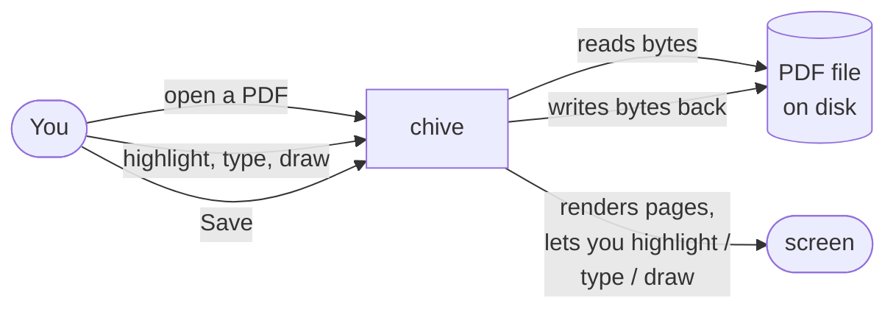

Chive is a desktop PDF reader/annotator: a Tauri native window around a
SvelteKit single-page app (no server — `ssr = false`, see
`src/routes/+layout.ts`). pdf.js does the actual PDF rendering and
annotation editing; the app's job is orchestrating pdf.js, presenting a
custom UI around it (not pdf.js's own default viewer chrome), and getting
bytes to and from disk through Tauri.

---

## 3. Directory & component map

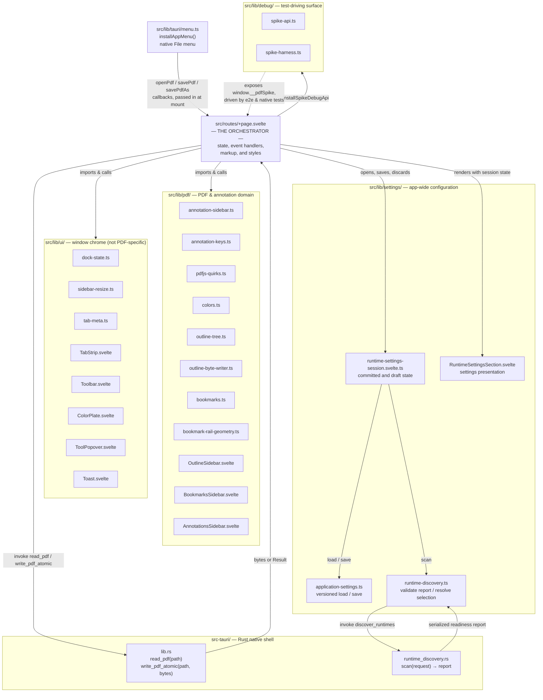

`+page.svelte` is the top-level orchestrator. It calls pure data/logic modules
(most of `lib/pdf/` and `lib/ui/`), hands plain data and callbacks to Svelte
presentation modules, coordinates the app-wide Settings session, and crosses
the native seams for file IO, runtime discovery, and the macOS menu. The debug
modules expose `window.__pdfSpike`, which both Playwright and native WebdriverIO
use to drive the real UI.

The runtime settings slice is deliberately deep at two seams. Rust accepts one
discovery request and returns one report while keeping candidate paths,
filesystem checks, process deadlines, output limits, and redaction private.
TypeScript exposes one `RuntimeDiscovery.scan` operation with native and
in-memory adapters, then keeps selection and Settings policy on the frontend
side. The Runtime Settings session owns the committed/draft split and scan
races; `RuntimeSettingsSection.svelte` only renders state and sends semantic
draft actions. See [ADR 0018](adr/0018-keep-runtime-discovery-native-and-selection-policy-in-typescript.md).

> **Design tension worth knowing about:** `installSpikeDebugApi` runs
> unconditionally at mount — there's no dev/prod build gate around it, and
> two of its methods (`loadPath`/`saveToPath`) reach the native file-IO
> commands directly. This is inherited as-is from the spike and is a
> deliberate ADR 0013 choice (keeping `window.__pdfSpike` stable so the
> transplanted test suites work unchanged) rather than an oversight, but
> it's an open question whether it should be gated before a real release
> build. See `tmp/issues.md` if present, or raise it fresh.

---

## 4. Annotation domain: data shapes

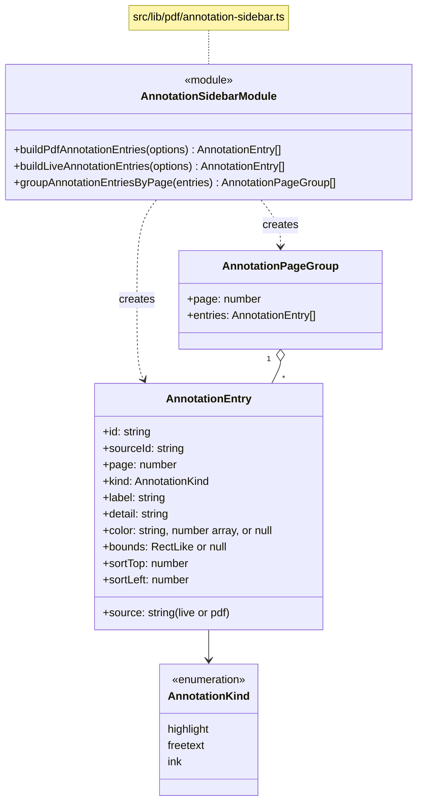

`AnnotationEntry` is the code-level shape of one **Annotation Sidebar
Entry** — `source: "pdf"` is a **Persisted Annotation Sidebar Entry**,
`source: "live"` is a **Live Annotation Sidebar Entry**, `detail` is its
**Annotation Snippet**, and `sortTop`/`sortLeft` are page-relative pixel
coordinates used purely for list ordering (see §7). Everything the
Annotations sidebar renders is an `AnnotationEntry[]`; it never touches a
pdf.js editor or a raw PDF annotation dictionary directly.

---

## 5. Sequence: app startup

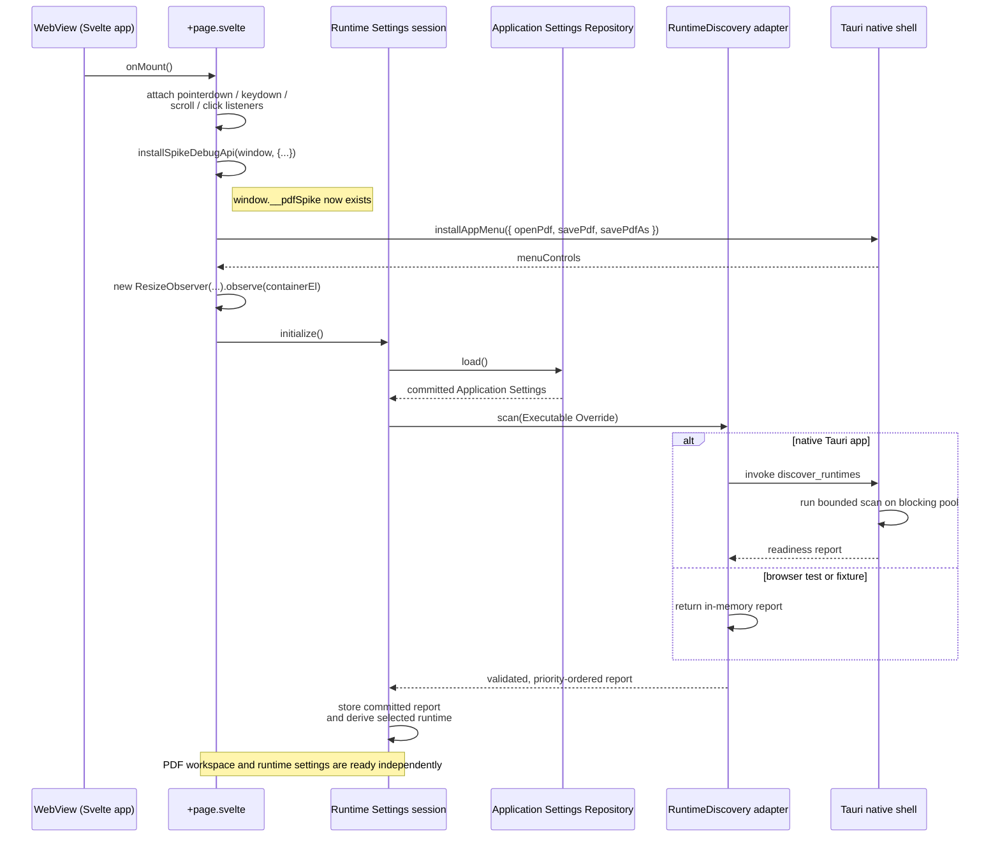

Opening the Application Settings Modal copies the committed settings and report
into a draft lane. Rescan changes only that draft report. Cancel discards the
draft; Save persists it and either promotes a matching draft report, retains a
matching committed report, or refreshes discovery in the background. Request
IDs ensure an older scan cannot replace a newer result.

---

## 6. Sequence: opening a PDF

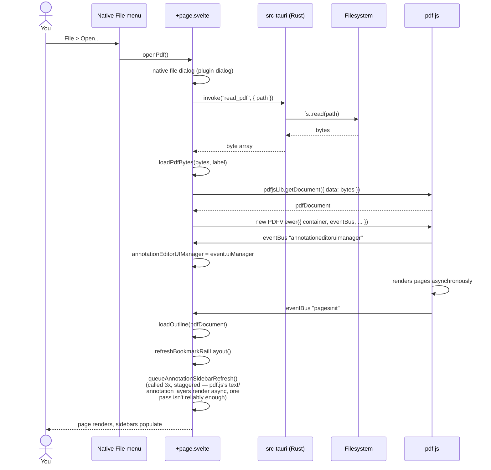

---

## 7. Sequence: annotation sidebar refresh & merge

This is the mechanism [ADR 0005](adr/0005-derive-annotation-sidebar-data-from-pdf-geometry.md)
decided, kept as the single place persisted and live annotations get
reconciled into one list.

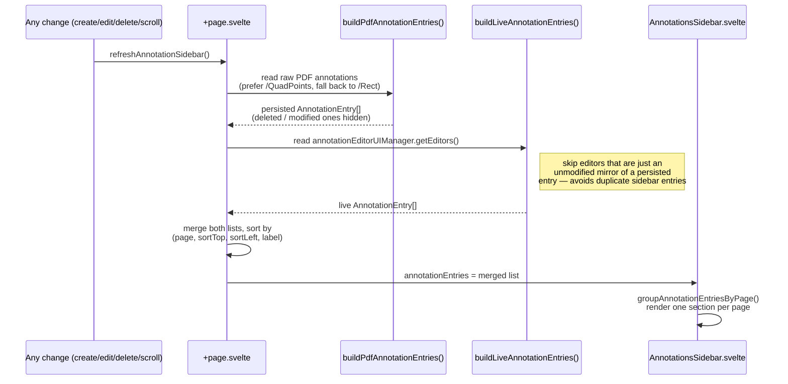

A subtlety worth knowing: when a Live Annotation Sidebar Entry stands in
for a Persisted Annotation Sidebar Entry, its `sortTop`/`sortLeft` are
**not** re-measured from the live editor's own DOM — they're read from a
cache of the persisted entry's geometry (`persistedPositionByKey`).
Re-measuring live would skew a few pixels from the persisted element's box
model and could reorder the entry past a neighbor on a pure text edit that
never moved anything — a real bug this project hit once (see the "Another
failure..." entries in ADR 0005).

---

## 8. Sequence: create → save → reopen an annotation

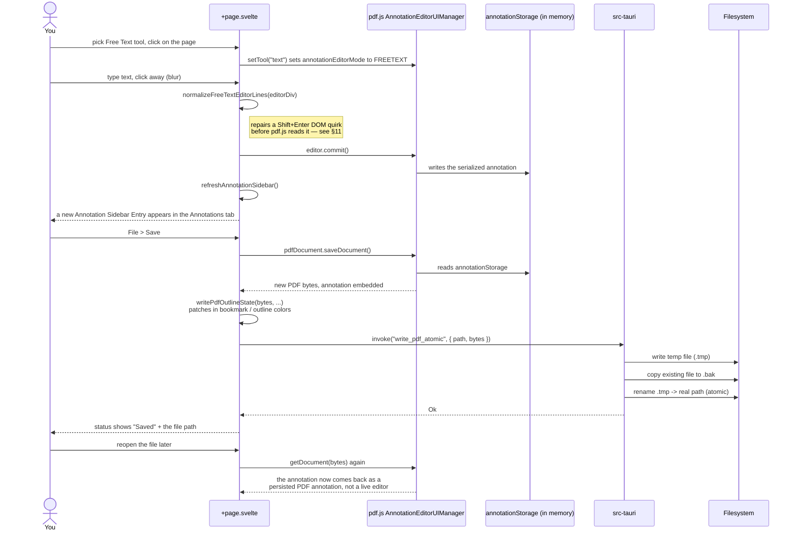

---

## 9. Flowchart: routing a pointerdown on the PDF

`handlePdfPointerDown` is the single most important — and most fiddly —
function in the app. [ADR 0013](adr/0013-transplant-spike-into-official-app.md)
notes it carries most of the spike's hard-won interaction fixes; this is a
simplified map of its core decision, not a line-by-line trace (read the
function itself, and [ADR 0002](adr/0002-treat-pdfjs-annotation-editor-lifecycle-as-risky.md)
/ [ADR 0015](adr/0015-let-armed-tools-create-over-existing-annotation-regions.md)
for the reasoning behind it).

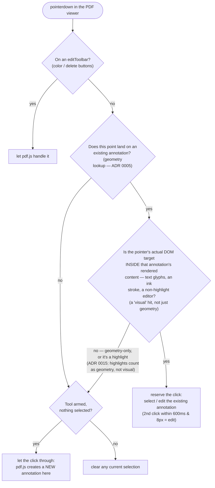

The one non-obvious rule: a **highlight** editor is deliberately treated as
a geometry hit, not a visual hit, even though visually the pointer is
"inside" it — because a live highlight editor is a rect-sized, fully
interactive DOM element (unlike free-text's tight glyphs or ink's thin
stroke), so almost every point inside one would otherwise count as visual
and defeat the point of letting tools draw over it. The accepted trade-off:
double-click-to-edit a highlight doesn't work while a tool is armed;
switch to selection mode (no tool) or use the sidebar instead.

---

## 10. State: one annotation's lifecycle

```mermaid
stateDiagram-v2
    [*] --> NoTool: app idle, no tool armed
    NoTool --> Creating: pick a tool, interact with the page
    Creating --> LiveUnsaved: pdf.js creates an editor;<br>value lives only in<br>annotationStorage (in memory)
    LiveUnsaved --> Selected: click selects it
    Selected --> Editing: double-click / enterInEditMode()
    Editing --> LiveUnsaved: editor.commit()
    LiveUnsaved --> Persisted: File > Save<br>(saveDocument() embeds it<br>into the PDF bytes)
    Persisted --> Selected: click a persisted annotation<br>(pdf.js mirrors it into a live editor)
    LiveUnsaved --> Deleted: Delete key / Delete Selected
    Persisted --> Deleted: Delete key / Delete Selected
    Deleted --> [*]: hidden immediately (a local<br>pending-delete set), removed from<br>the PDF on next save
```

"Selected" here is what `CONTEXT.md` calls giving the entry **Annotation
Focus** — the temporary dashed on-page box plus its sidebar selected state,
not a persistent "edit mode."

## 11. State: the free-text Shift+Enter DOM quirk

pdf.js's own `#extractText` assumes its `FreeTextEditor` content is always
shaped as one `<div>` per line, and strips embedded line breaks *inside*
each `<div>` when reading it. Chrome and WebKit's Shift+Enter insert a
`<br>` *inside* the current line's `<div>` instead of splitting it into two
divs — so without intervention, committing merges the two visual lines into
one run-on line while the stray `<br>` keeps the DOM *looking* multi-line a
moment longer. `normalizeFreeTextEditorLines` (in `pdfjs-quirks.ts`) rebuilds
the canonical shape from `innerText` before every commit path.

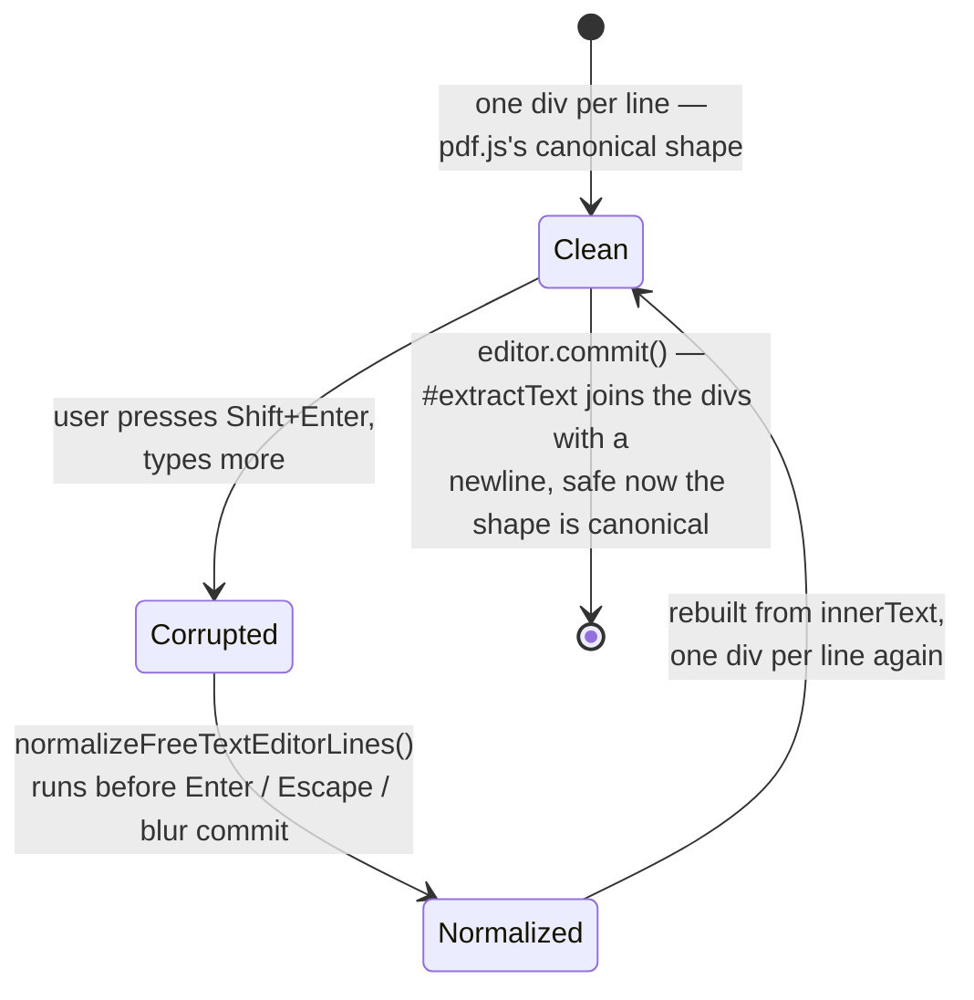

This is one instance of a broader pattern: **`pdfjs-quirks.ts` is the one
file that's allowed to know about pdf.js's private, undocumented internals**
(stale-AbortSignal handling, editor-type guards, this line-normalization
fix). If you're about to reach into a pdf.js object's private-looking field
anywhere else in the codebase, it probably belongs in that module instead —
see the module's own header comment for the existing rationale. Also see
[ADR 0014](adr/0014-treat-pdfjs-bundled-css-as-unscoped-and-adversarial.md):
pdf.js's *CSS* (not just its JS internals) can surprise you too — it ships
globally, unscoped, and has silently overridden this app's own `.sidebar`
width and highlight-editor pointer-events in the past.

---

## 12. State: sidebar dock

```mermaid
stateDiagram-v2
    [*] --> Default: createDefaultDockState() —<br>left starts with outline, bookmarks,<br>annotations; right starts empty

    state "Tab visible on a side" as Visible
    state "Side hidden (collapsed)" as Hidden

    Default --> Visible
    Visible --> Visible: moveTabToSide(tab, side, beforeTab)<br>— drag a tab, same or other side
    Visible --> Hidden: hideSide(side)<br>(side-collapse button)
    Hidden --> Visible: showSide(side) — edge-reopen button,<br>or activateTab() on that side
```

`left` and `right` each have their own independent `{ order, active,
hidden }` (the diagram collapses both sides into one picture for
readability — see `DockState` in `src/lib/ui/dock-state.ts`). All
transitions are pure functions that return a new `DockState`; `+page.svelte`
holds the whole thing in one `$state` and reassigns it.

Sidebar **width** is a separate, parallel piece of state
(`sidebarWidths: { left, right }` in `src/lib/ui/sidebar-resize.ts`), driven
by a drag handle on each sidebar's inner edge, clamped to 260–600px, and
persisted to `localStorage`. `.workspace`'s CSS grid track sizes come from
this state via an inline style, not from static CSS — see
[ADR 0016](adr/0016-sidebar-width-is-js-state-not-pure-css.md) if you're
about to change sidebar layout and the CSS alone doesn't explain what you're
seeing.

---

## 13. Testing pyramid

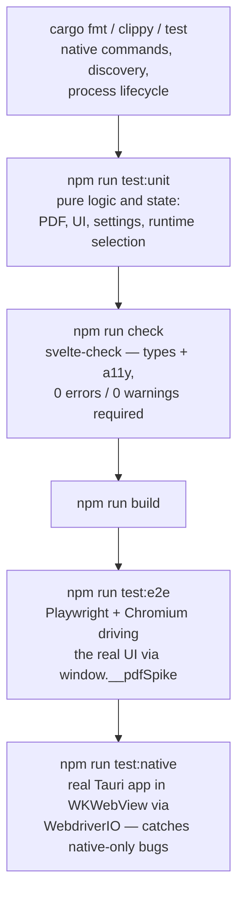

Run the Rust checks whenever `src-tauri/` changes. The unit → check → build →
browser → native sequence is the full app gate (see root `AGENTS.md`). The
native step exists because pdf.js text
extraction and annotation editing genuinely differ between Chromium and
WKWebView — several bugs in this codebase's history only reproduced there
(see [ADR 0006](adr/0006-test-pdfjs-in-native-tauri-webview-not-only-browser.md)
/ [ADR 0007](adr/0007-add-native-wkwebview-smoke-tests-with-wdio-tauri.md)).

---

## 14. Where to go deeper

| If you're touching... | Read |
|---|---|
| Annotation Sidebar Entries, sort order, live/persisted merging | [ADR 0005](adr/0005-derive-annotation-sidebar-data-from-pdf-geometry.md) |
| Any pdf.js editor lifecycle (create/select/edit/save/reopen) | [ADR 0002](adr/0002-treat-pdfjs-annotation-editor-lifecycle-as-risky.md) |
| `handlePdfPointerDown` / creation vs. select-edit routing | [ADR 0015](adr/0015-let-armed-tools-create-over-existing-annotation-regions.md) |
| Ink annotations that don't behave like plain ink | [ADR 0012](adr/0012-treat-inkhighlight-as-highlight-intent.md) |
| Native Outline Color (Document Outline Entries or Chive Bookmarks) | [ADR 0011](adr/0011-use-native-pdf-outline-colors.md) |
| Adding any new CSS class name | [ADR 0014](adr/0014-treat-pdfjs-bundled-css-as-unscoped-and-adversarial.md) |
| Sidebar width / resize / `.workspace` grid | [ADR 0016](adr/0016-sidebar-width-is-js-state-not-pure-css.md) |
| Runtime discovery, probing, selection, or Runtime Settings state | [ADR 0018](adr/0018-keep-runtime-discovery-native-and-selection-policy-in-typescript.md) |
| Why native WKWebView tests exist at all | [ADR 0006](adr/0006-test-pdfjs-in-native-tauri-webview-not-only-browser.md), [0007](adr/0007-add-native-wkwebview-smoke-tests-with-wdio-tauri.md) |
| Why `app/` exists separately from the spike | [ADR 0013](adr/0013-transplant-spike-into-official-app.md) |

For command references (dev server, test suites, pinned dependency
versions), see the root `AGENTS.md`, not this document — it changes more
often than the architecture does.
