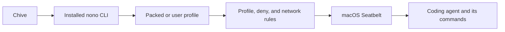

# SP1 Confinement Findings

Status: **Complete. E0, E3, E4, E5, E6, E7, and E8 passed. The final
architecture decision is GO.**

Issue: [#47](https://github.com/cfchou/chive/issues/47)

Parent: [#46](https://github.com/cfchou/chive/issues/46)

## Decision

Chive will launch a compatible user-installed nono CLI. It will use that
installation's normal config, installed packs, and selected packed or user
profiles.



Chive will not embed nono's core crates, copy or bundle the nono binary, or
maintain copies of nono's agent profiles as the normal integration path.
[ADR 0019](../../../docs/adr/0019-use-installed-nono-cli-for-agent-confinement.md)
records the reasons and trade-offs.

This result clears the architecture for production work in #32. It does not
mean the production Tauri adapter is already implemented.

## Final experiment results

| Experiment | Result | What it established |
|---|---|---|
| E0 installed stack | **PASS** | One installed nono 0.69.0 executable, its normal config, packs, and selected profiles formed one coherent stack. |
| E3 coding-agent turns | **PASS** | Codex, Claude Code, and OpenCode completed model turns and ran shell commands in the supplied workspace. |
| E4 network choices | **PASS** | `open`, `agent-only`, and `restricted` behaved as defined for all three coding agents. |
| E5 credentials | **PASS** | All three agents worked with their existing saved login state. The tested nono API-key routes did not replace those logins. |
| E6 one OS sandbox | **PASS** | Nono remained the outer macOS sandbox. Codex and Claude disabled their inner OS sandboxes; the tested OpenCode version has none around its shell process. |
| E7 observed hosts | **PASS** | Each selected runtime setup has versioned host observations from an account check and two model turns. |
| E8 installed dependency | **PASS** | Installed-stack checks, launch without registry access, input/output, exit status, cancellation, forced stop, and descendant cleanup passed. |

## Installed stack

The counted runs used:

| Runtime | Latest version exercised in SP1 | Selected profile |
|---|---:|---|
| Codex | 0.145.0 | `nolabs-ai/codex` |
| Claude Code | 2.1.218 | `nolabs-ai/claude` |
| OpenCode | 1.18.4 | `opencode-0723a` |

`opencode-0723a` is a user profile. It extends the installed OpenCode pack and
adds paths for this machine's Bun, mise, and user configuration. This is why
Chive must support nono's user-profile directory instead of trying to predict
every valid runtime installation.

The tested nono version is 0.69.0. A different nono version, executable hash,
pack lockfile, packed-profile hash, or selected user-profile hash makes this
evidence stale and requires validation again.

The repository does not keep Cargo build output. Rebuild the spike adapter from
the Chive repository root with:

```sh
cargo build \
  --manifest-path spikes/workspace-runtime/confinement/sidecar-harness/Cargo.toml
```

## Workspace and process boundary

The Chive harness option `--workspace-rw <workspace>` has two jobs:

```text
--workspace-rw <workspace>
    -> nono -a <workspace>          read-write access
    -> nono --workdir <workspace>  child current directory
```

Codex and Claude Code used that current directory. OpenCode 1.18.4 also needed
its documented `--dir <workspace>` argument so its own project selection agreed
with the process current directory.

The adapter owns one Unix process group containing nono, the coding agent, and
all commands started below it. Normal cancellation sends TERM to the group.
Forced stop sends KILL to the same group. The E8 checks left no recorded
descendants running in either case.

## Network choices

Chive's three choices are:

- `open`: allow all network access;
- `agent-only`: allow only the explicit hosts needed by the selected coding
  agent and model provider; and
- `restricted`: allow the agent hosts plus extra hosts explicitly approved for
  the run.

The final limited-mode trials used:

| Runtime | Required provider hosts in the counted trial |
|---|---|
| Codex | `chatgpt.com` |
| Claude Code | `api.anthropic.com`, `platform.claude.com` |
| OpenCode | `api.githubcopilot.com` |

Optional telemetry and configured-tool hosts were not added merely because
they appeared during observation. These lists belong to the tested versions,
profiles, account state, and provider choices. They are not permanent or
claimed to be mathematically minimal.

In the final matrix, every coding agent completed its own shell checks in all
three modes. `agent-only` denied `example.com`. `restricted` allowed
`example.com` and still denied `www.iana.org`.

## Credentials and profile access

All three selected profiles used the user's existing saved login state:

| Runtime | Working posture | Broader access disclosed by the selected profile |
|---|---|---|
| Codex | Direct saved login | Read-write access to the Codex state directory |
| Claude Code | Direct saved login | Read-write access to Claude state and the login Keychain directory |
| OpenCode | Direct saved provider login | Read-write access to OpenCode provider state and access to the login Keychain file |

The tested nono credential routes target separate API-key flows. They did not
replace the current ChatGPT, Claude account, or GitHub Copilot login. Chive
must not describe the first integration as credential isolation or injection.

The selected profiles also grant broader filesystem access than an
exact-workspace policy. This is an accepted compatibility trade-off for the
first integration. Chive must show the selected profile source and important
access before the user trusts it. Profile shrinking is later hardening, not an
SP1 exit condition.

## One OS sandbox

Exactly one OS sandbox means the outer nono Seatbelt policy:

| Runtime | Required rule |
|---|---|
| Codex | Launch with `--dangerously-bypass-approvals-and-sandbox` so Codex does not apply another OS sandbox. |
| Claude Code | Pass one-run settings with `sandbox.enabled: false`; `--dangerously-skip-permissions` concerns tool approval, not the Bash OS sandbox. |
| OpenCode | The tested 1.18.4 shell path has permission checks but no OS sandbox to disable. |

Agent permission rules, safe mode, plugin controls, and project rules are not
additional OS sandboxes.

## Production work left for #32

- Add settings and guided setup for the canonical absolute nono path.
- Support exactly nono 0.69.0 until another version passes the checks.
- Save readiness evidence keyed by executable, lockfile, packed-profile, and
  user-profile hashes.
- Show profile source and important access; do not hide short-name shadowing.
- Set `NONO_NO_UPDATE_CHECK=1` and do not pull, update, wire, or repair packs
  during a normal runtime launch.
- Pass the workspace grant and current directory together.
- Build the final runtime-specific Codex, Claude Code, and OpenCode commands.
- Own one process group and target the whole group for TERM and KILL.
- Repeat the preflight and one model turn from the final signed and notarized
  Chive app.
- Explain setup and recovery without silently changing the user's nono state.

## Retained evidence

- [E0 installed-stack inventory](transcripts/e0-installed/run-20260723-002.md)
- [E3 selected-profile coding-agent turns](transcripts/e3-runtime-turns/run-20260723-002.md)
- [E3 OpenCode user-profile source](transcripts/e3-profile-inputs/opencode-0723a.run-20260723-002.source.json)
- [E4 Phase 0 proxy behavior](transcripts/e4-e7-network/run-20260725-005.md)
- [E4 Phase 1 and E7 host observations](transcripts/e4-e7-network/run-20260725-006.md)
- [E4 Phase 1 machine-readable record](transcripts/e4-e7-network/phase1-proxy.run-20260725-006.json)
- [E4 Phase 2 final network matrix](transcripts/e4-e7-network/run-20260725-007.md)
- [E4 Phase 2 machine-readable record](transcripts/e4-e7-network/phase2-audit.run-20260725-007.json)
- [E5 credential matrix](transcripts/e5-credentials/run-20260725-008.md)
- [E5 machine-readable results](transcripts/e5-credentials/credential-matrix.run-20260725-008.json)
- [E6 one-OS-sandbox matrix](transcripts/e6-nested-sandbox/run-20260725-009.md)
- [E6 machine-readable result](transcripts/e6-nested-sandbox/sandbox-matrix.run-20260725-009.json)
- [E8 installed dependency and process lifecycle](transcripts/e8-installed-dependency/run-20260725-010.md)
- [E8 machine-readable result](transcripts/e8-installed-dependency/installed-adapter.run-20260725-010.json)
