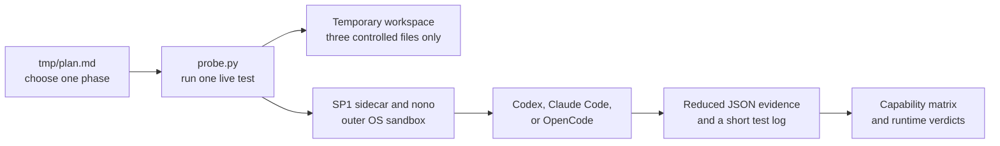
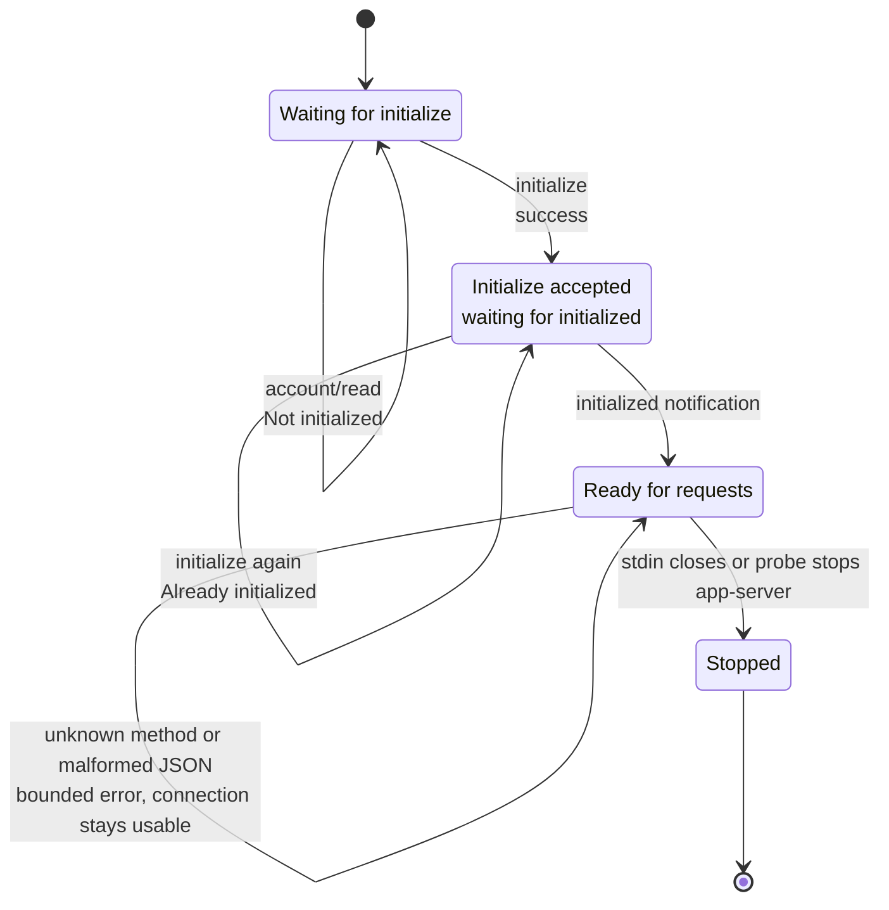
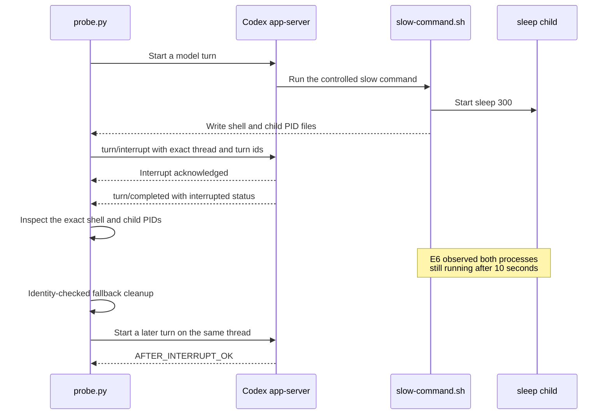
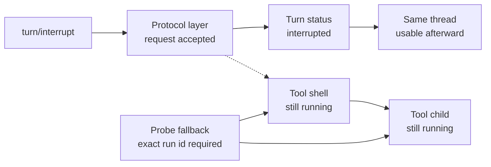
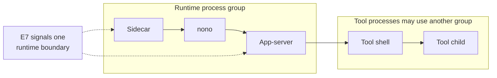
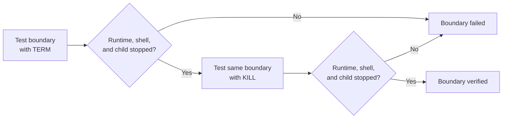
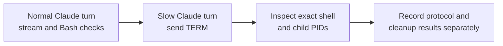
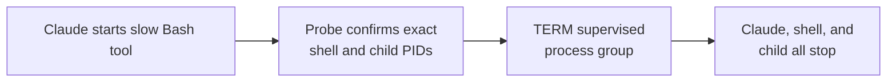
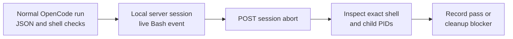
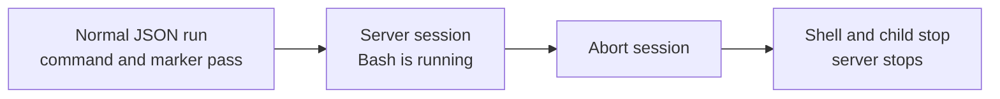

# SP2 headless runtime test tools

This folder holds the test tools and controlled input files for the
[issue #48](https://github.com/cfchou/chive/issues/48) protocol spike.

The tests ask a narrow question: can Chive start, talk to, interrupt, and stop
Codex, Claude Code, and OpenCode through the outer sandbox chosen in SP1?

This is test code. It does not implement a production runtime adapter and does
not change the Chive app. Follow [`tmp/plan.md`](../../../tmp/plan.md) one phase
at a time instead of running every model-backed test at once.

## What each file does

| Path | Purpose |
| --- | --- |
| `probe.py` | Runs one selected live test and writes redacted JSON evidence. |
| `test_probe.py` | Runs focused local checks against the probe without contacting a model. |
| `fixtures/workspace/probe-marker.txt` | Gives a runtime a known file to read from the test workspace. |
| `fixtures/workspace/slow-command.sh` | Starts a known shell and child process for interruption and cleanup checks. |
| `fixtures/workspace/claude-settings.json` | Turns off Claude Code's inner sandbox because nono is the outer sandbox. |
| `transcripts/` | Holds reduced JSON evidence and one short Markdown log per test. |
| `findings.md` | Records the final capability matrix, limits, and runtime verdicts. |

The folder retains the Phase 0, Phase 1, E1–E7, Phase 5, and Phase 6 audit
evidence. E4 found inherited Codex configuration and is partial, not blocking. E5 passed
with that inherited configuration recorded. E6 proved protocol interruption
but found that both controlled tool processes survived and needed fallback
cleanup. E7 found that app-server and sidecar termination also left both tool
processes running. Codex is **VIABLE PROTOCOL / PRODUCTION BLOCKED** until a
stronger process-tree supervisor is tested. Claude Code Phase 5 passed: its
normal JSONL turn worked, and supervised-group `TERM` stopped Claude and both
controlled tool processes. OpenCode Phase 6 also passed: its normal JSON turn,
live server event, session abort, tool-process cleanup, session deletion, and
server shutdown all met the smoke-test checks.

SP2 deliberately does not publish protocol replay fixtures. If future adapter
tests need them, create only the fixtures those tests consume and assert
against.

## Test flow



Every counted runtime starts through the SP1 sidecar and nono. The runtime gets
a new temporary workspace containing copies of only these files:

```text
probe-marker.txt     known text: CHIVE_SP2_MARKER
slow-command.sh      known long-running shell and sleep child
claude-settings.json controlled Claude Code sandbox setting
```

The temporary workspace is deleted after the test. Saved evidence uses
`<WORKSPACE>`, `<HOME>`, and similar placeholders instead of private paths and
account details.

## Codex initialization state machine [phase 2]

The Phase 2 handshake checks these states before it starts any model turn.



`initialize` is a request, so Codex sends a response. `initialized` is a
notification sent once after that response, so it has no response of its own.
An error loop means the request failed but the connection stayed in the same
usable state.

## Before the first test

Run commands from the Chive repository root.

Build the sidecar used to put the runtime inside nono:

```sh
cargo build \
  --manifest-path spikes/workspace-runtime/confinement/sidecar-harness/Cargo.toml
```

Check the test tools without contacting a model:

```sh
python3 -m py_compile \
  spikes/workspace-runtime/protocol/probe.py

cd spikes/workspace-runtime/protocol
python3 -m unittest -v test_probe.py
cd ../../..

sh -n spikes/workspace-runtime/protocol/fixtures/workspace/slow-command.sh
```

The SP1 boundary and its assumptions are recorded in
[`confinement/findings.md`](../confinement/findings.md).

## Run examples

Give each attempt a new run id and a new output path. Retained commands below
show the run id used by that experiment; use a new one for a new attempt.

Inventory installed versions, login readiness, and executable hashes:

```sh
python3 spikes/workspace-runtime/protocol/probe.py inventory \
  --out spikes/workspace-runtime/protocol/transcripts/phase0-inventory/run-20260727-001.json
```

Generate and inspect Codex's stable and experimental schemas without repeating
the Phase 0 auth checks:

```sh
python3 spikes/workspace-runtime/protocol/probe.py schema \
  --out spikes/workspace-runtime/protocol/transcripts/phase2-codex-schema-handshake/e1-schema.run-20260731-025.json
```

Codex can emit the same schema with JSON object keys in a different order. The
probe sorts those keys before hashing, so E1 records a stable fingerprint of
the schema meaning instead of its incidental file order.

Run only the Phase 2 initialization state machine. This command does not start
a Codex thread or contact a model:

```sh
python3 spikes/workspace-runtime/protocol/probe.py codex-handshake \
  --out spikes/workspace-runtime/protocol/transcripts/phase2-codex-schema-handshake/e2-handshake.run-20260727-010.json
```

Run only the Phase 3 per-conversation settings test. This starts two ephemeral
threads but does not start a model turn:

```sh
python3 spikes/workspace-runtime/protocol/probe.py codex-thread-config \
  --out spikes/workspace-runtime/protocol/transcripts/phase3-codex-config-stream/e3-thread-config.run-20260727-011.json
```

Re-check the finished E4 verdict against the retained counted summaries,
installed app-server flags, supported per-server and feature switches, and
fresh-state authentication. This does not start app-server, start a model turn,
or retain MCP server names:

```sh
python3 spikes/workspace-runtime/protocol/probe.py codex-config-isolation-final \
  --out spikes/workspace-runtime/protocol/transcripts/phase3-codex-config-stream/e4-config-isolation-final.run-20260727-013.json
```

Run the model-free E5 inherited-config posture pre-check. It starts one
ephemeral thread but does not send `turn/start`. Raw config responses stay in
memory and are reduced to public groups and anonymous counts:

```sh
python3 spikes/workspace-runtime/protocol/probe.py codex-config-posture \
  --out spikes/workspace-runtime/protocol/transcripts/phase3-codex-config-stream/e5-config-posture.run-20260728-015.json
```

Run the E5 streamed controlled-workspace turn and one same-thread follow-up.
This is model-backed and uses inherited user configuration. Raw model text and
arbitrary command output are checked in memory but are not retained. The exact
controlled path-and-marker output is retained with the workspace redacted:

```sh
python3 spikes/workspace-runtime/protocol/probe.py codex-stream \
  --out spikes/workspace-runtime/protocol/transcripts/phase3-codex-config-stream/e5-stream.run-20260728-017.json
```

Run E6. This waits for the controlled slow shell and child before sending
`turn/interrupt`, then checks both processes and a later turn separately. It is
model-backed and uses inherited user configuration:

```sh
python3 spikes/workspace-runtime/protocol/probe.py codex-interrupt \
  --out spikes/workspace-runtime/protocol/transcripts/phase4-codex-interrupt-cleanup/e6-interrupt.run-20260728-019.json
```

Run E7. This starts a separate controlled turn for the app-server PID,
app-server process group, and outer sidecar group. A fourth forced-stop attempt
runs only if one existing boundary stops both tool processes. It is
model-backed and uses inherited user configuration:

```sh
python3 spikes/workspace-runtime/protocol/probe.py codex-lifecycle \
  --out spikes/workspace-runtime/protocol/transcripts/phase4-codex-interrupt-cleanup/e7-lifecycle.run-20260730-020.json
```

Run the Claude Code Phase 5 normal and interrupted turns:

```sh
python3 spikes/workspace-runtime/protocol/probe.py claude \
  --out spikes/workspace-runtime/protocol/transcripts/phase5-claude-smoke/phase5-claude-smoke.run-20260730-022.json
```

Run the OpenCode Phase 6 smoke:

```sh
python3 spikes/workspace-runtime/protocol/probe.py opencode \
  --out spikes/workspace-runtime/protocol/transcripts/phase6-opencode-smoke/phase6-opencode-smoke.run-20260730-023.json
```

These calls use saved runtime login state and may make network requests. Run
only the phase currently being checked. If a normal runtime turn fails, keep
that blocker and do not treat an interruption attempt as useful evidence.

## Write the short test log

Place one Markdown file beside each JSON result. Record only actions that ran or
controlled that test. Do not record repo browsing, plan edits, formatting
checks, file moves, or other setup work.

Prefix every numbered experiment artifact with its lowercase plan label. For
example, E1 uses `e1-schema...`, E2 uses `e2-handshake...`, and E3 uses
`e3-thread-config...`. Give the JSON result and its Markdown transcript the
same name before their extension.

For example:

```markdown
# E2 Codex initialization

- Run id: `run-20260727-002`
- Launch: `<redacted sidecar argv>`
- Input: initialize, initialized, account/read
- Expected: one initialize succeeds; a repeat initialize is rejected
- Result: PASS, PARTIAL, FAIL, or SHOWSTOPPER
- Cleanup: app-server and controlled tool processes stopped
```

The Markdown log explains the test in human terms. The JSON file keeps the
machine-readable event order and checks. Keep both; neither replaces the other.

## How E6 tests protocol interruption

E6 checks whether Codex's `turn/interrupt` request stops both the model turn and
the tool processes started by that turn. These are separate results: an
acknowledged request or an `interrupted` turn status does not prove that a shell
process stopped.

The slow command writes the exact process ids owned by the test. The probe waits
for the command-start event and both PID files before it interrupts anything.
This proves the interruption happened during a real tool call instead of during
model generation.



E6 records these checks separately:

| Check | What it proves | E6 result |
| --- | --- | --- |
| Interrupt acknowledged | App-server accepted `turn/interrupt` | **PASS** |
| Terminal turn status | Codex ended the turn as `interrupted` | **PASS** |
| Tool shell stopped | The shell ended because of the interrupt | **FAIL** |
| Tool child stopped | The `sleep` child ended because of the interrupt | **FAIL** |
| Later turn usable | The same app-server thread still worked | **PASS** |
| Fallback cleanup | The test leaked no controlled process | **PASS**, but not credited to Codex |



The run id is a cleanup safety check. The fallback refuses to signal a
surviving process if its command line does not contain the unique controlled
run id. Its successful cleanup prevents a test leak, but it does not turn the
Codex process-cleanup result into a pass.

E6 is therefore **PARTIAL**: the protocol interruption and later connection
reuse work, but `turn/interrupt` did not stop either controlled tool process.
E7 tests whether stopping a larger runtime boundary can close that cleanup gap.

## How E7 tests runtime loss and process cleanup

E6 tests the `turn/interrupt` protocol request. E7 asks a different question:
what happens to a running tool when Codex or its outer runtime boundary
disappears?

The normal process lineage looks like this:



The app-server process group can be the same as the outer sidecar group. E7
resolves both group ids from the live process tree instead of assuming they are
different.

Each attempt starts a fresh Codex session and follows the same steps:

1. Start the controlled slow shell and child.
2. Wait for the command-start event and both exact PID files.
3. Record PID, parent PID, process group, session, and state for the sidecar,
   nono, app-server, tool shell, and tool child.
4. Signal one boundary.
5. Inspect the same exact process ids again.
6. Use identity-checked fallback cleanup if the shell or child survived.

The three required boundaries are:

- Attempt 1 sends `TERM` to only the Codex app-server PID.
- Attempt 2 sends `TERM` to the app-server process group. If that target group
  is still running at the deadline, the same attempt escalates to `KILL`.
- Attempt 3 does the same for the outer sidecar process group.

The conditional `KILL` in attempts 2 and 3 finishes the current shutdown when
`TERM` cannot stop the targeted runtime group. If that escalation also stops
both tool processes, the same attempt already covers the forced-stop path.

A separate fourth attempt is needed only when `TERM` stops the targeted runtime
and both tool processes without needing `KILL`. E7 then starts a fresh session
and force-kills that same boundary to prove its forced-stop path too. E7 does
not invent a new production supervisor inside this spike.

Put simply, the fourth attempt verifies that a boundary which works with
`TERM` also works with `KILL`. Here, “works” means the runtime, tool shell, and
tool child all stop. An app-server exit by itself is not enough.



A clean app-server exit is not cleanup proof. A boundary passes only when both
the controlled shell and child are no longer running. Fallback cleanup prevents
a test leak, but it does not turn a failed runtime boundary into a pass.

If none of the existing boundaries stops both processes, the Codex result is
**VIABLE PROTOCOL / PRODUCTION BLOCKED**. S4 must then provide and test a
stronger process-tree supervisor before the adapter can be production-ready.

### Observed E7 result

E7 observed that sidecar, nono, and app-server shared one process group. The
tool shell and child shared a different process group. When the runtime group
stopped, the shell was reparented to PID 1 and continued running with its
child.

| Boundary | Runtime stopped | Tool shell stopped | Tool child stopped |
| --- | --- | --- | --- |
| App-server PID | yes | **no** | **no** |
| App-server process group | yes | **no** | **no** |
| Outer sidecar process group | yes | **no** | **no** |

The app-server and outer sidecar process groups were the same signal target in
the tested stack. All three attempts required identity-checked fallback cleanup
for the shell and child. No fourth attempt ran because no existing boundary
qualified as a final candidate.

## How Phase 5 relates to Codex E5-E7

Phase 5 is a smaller Claude Code version of the Codex E5-E7 checks. It uses
Claude Code's one-shot `-p` command, so it checks the parts that this interface
can show directly.

| Codex experiment | Claude Code Phase 5 check |
| --- | --- |
| E5 streaming and tool execution | Run one normal `stream-json` turn, observe partial, message, and tool events, then verify the controlled cwd and marker. |
| E6 interruption and child cleanup | Send `TERM` to the supervised process group during the controlled slow command, then inspect the exact tool shell and child PIDs. |
| E7 runtime-boundary cleanup | Check only the outer supervised process group and use identity-checked fallback cleanup if a controlled process survives. |



Phase 5 does not repeat Codex's protocol-level `turn/interrupt`, interruption
acknowledgement, terminal turn status, later-turn reuse, three E7 boundary
attempts, or separate forced-`KILL` candidate test. Claude runs with
`--no-session-persistence`, so later-turn reuse is outside this smoke test.

In short, Phase 5 is **E5 plus a reduced E6/E7 lifecycle smoke test for Claude
Code**, not a full copy of the Codex experiments.

### Observed Phase 5 result

The normal Claude turn passed every check. Claude Code 2.1.218 reported the
controlled cwd, bypass permission mode, and `claude-sonnet-4-6`. The JSONL
stream contained partial, assistant, Bash tool-use, tool-result, and successful
result events. The controlled command returned `<WORKSPACE>` and
`CHIVE_SP2_MARKER`, and Claude exited 0.

The interruption turn reached the slow Bash tool call and both exact fixture
PIDs. Sending `TERM` to the supervised process group stopped Claude, the tool
shell, and the tool child. `KILL` was not needed, and fallback cleanup performed
zero actions.



Phase 5 is **PASS**. This proves the tested one-shot Claude wrapper path. It
does not add a Claude protocol-level interrupt request or later-turn reuse.

## How Phase 6 relates to Codex E5-E7

Phase 6 is the OpenCode version of the same small runtime smoke test. It starts
with the one-shot `opencode run` command and uses `opencode serve` only if
`run` cannot provide enough stream or interruption evidence inside the
timebox.

The global OpenCode command upgraded to 1.18.9 before this phase. Phase 0 froze
1.18.4, and the exact 1.18.4 binary remains in Bun's cache with the recorded
SHA-256. The probe launches that pinned binary directly and stops before a
model request if its version, file, or hash no longer matches. This prevents
one Phase 6 artifact from mixing two OpenCode versions.

| Codex experiment | OpenCode Phase 6 check |
| --- | --- |
| E5 streaming and tool execution | Run one normal `--format json` turn, distinguish tool start, tool result, assistant text, success, and error events, then verify the controlled cwd and marker. |
| E6 interruption and child cleanup | Start one local server session, observe the live Bash `running` event over SSE, call the session abort route, then inspect the exact tool shell and child PIDs. |
| E7 runtime-boundary cleanup | Stop and reap the local server after the attempt. Use identity-checked fallback cleanup if the controlled shell or child survives, but do not credit fallback work to OpenCode. |



`--pure` disables external OpenCode plugins. It does not claim that all user
configuration is isolated, and it is not an OS sandbox. `--auto` avoids an
approval prompt for the controlled shell command. The SP1 sidecar and nono
remain the outer OS boundary.

Pinned 1.18.4 source and a model-free loopback check showed that `run` emits a
completed/error tool record but no separate live tool-start record. The local
server does expose an SSE event stream, async prompts, and a session abort
route. Phase 6 therefore uses `run` for the normal turn and one `serve` session
for live tool-start and interruption evidence.

Phase 6 does not repeat Codex's later-turn reuse, three E7 boundary attempts,
or separate forced-`KILL` candidate test. It records the server abort response,
post-abort session status, exact shell and child state, and final server reap as
separate facts.

In short, Phase 6 is **E5 plus a reduced E6/E7 lifecycle smoke test for
OpenCode**. Its result must keep stream behavior and process cleanup as
separate facts.

### Observed Phase 6 result

The normal OpenCode turn passed every check. The pinned OpenCode 1.18.4 binary
still matched the Phase 0 SHA-256. `opencode run --format json` emitted valid
step-start, completed Bash tool, step-finish, and assistant-text records. The
controlled output was `<WORKSPACE>` plus `CHIVE_SP2_MARKER`, and the process
exited 0.

The server session exposed the controlled Bash part in its live `running`
state over SSE. The probe confirmed the exact shell and child PIDs, their
parent relationship, and their shared process group. The session abort request
succeeded and both processes were gone at the first inspection. Fallback
cleanup performed zero actions. The test session was deleted and the local
server stopped.



Phase 6 is **PASS** at its planned smoke depth. It does not establish
later-turn reuse, cleanup across the three Codex E7 runtime boundaries, or a
forced-`KILL` path.

## Evidence boundaries

- Raw runtime output is redacted before it is written into this repository.
- The evidence does not keep emails, tokens, account identities, MCP server
  names, private hostnames, or full user configuration.
- Changing timing and process ids are audit details, not stable adapter
  contracts.
- A successful runtime exit is not proof that its tool processes stopped.
- Browser and native app regressions are not part of this spike because these
  tools do not change `app/`.
- Keep only evidence used by the final verdict. Remove superseded harness and
  debugging attempts instead of building a history of abandoned runs.
